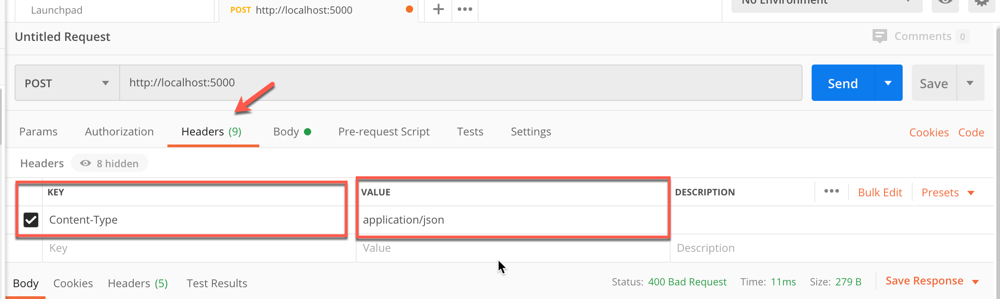
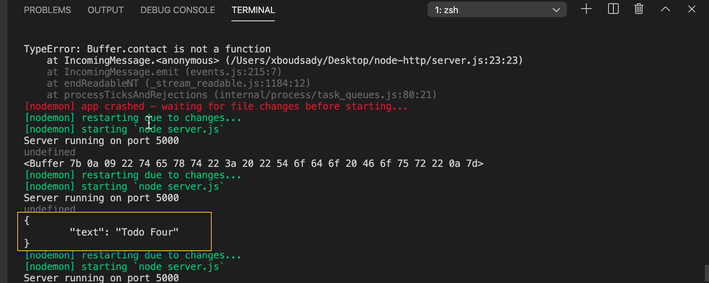

# Node Http Module

## The `http` module

Node.js has a built-in moudle called HTTP, which allows Node.js to transfer data over the Hyper Text Transfer Protocol (HTTP).

* As a Web Server `http.createServer()`

```js
// Import the library we'll be using.
const http = require('http');

// Create a variable for JSON data to be returned
const todos = [
    { id: 1, text: 'Todo One'},
    { id: 2, text: 'Todo Two'},
    { id: 3, text: 'Todo Three'},
]

// Use the `http` module create a server, and set it's parameter.
const server = http.createServer((req, res) => {
    res.setHeader('Content-Type', 'aplication/json');
    res.setHeader('X-Powered-By', 'Node.js');
    // We want o send data from data variable.
    res.end(JSON.stringify({
        success: true,
        data: todos
    }));
});

// Create a port number
const PORT = 5000;

// Call our server, by using the listen() method
server.listen(PORT, () => console.log(`Server running on port ${PORT}`));
```

## 404 Status

We can pass various status to our server for a response.

```js
const server = http.createServer((req, res) => {
    res.writeHead(400, {
        'Content-Type' : 'aplication/json',
        'X-Powered-By' : 'Node.js'
      });
    
    // We want to send data from data variable.
    res.end(
        JSON.stringify({
            success: false,
            error: 'Please add email',
            data: null
        })
    );
});

```

## Sending Data to the Server

We can send data to the server as  JSON, by using the `request.on()` method, passing in `data` and `chunk` as a second parameter with a callback function to push the `chunk` of data into `body`.

```js
// Create an empty array variable
let body = [];

// In the request, send data to the body, using Array.push()
req.on('data', chunk => {
    body.push(chunk);
}).on('end', () => {
    body = Buffer.concat(body).toString();
    console.log(body);
});
```


